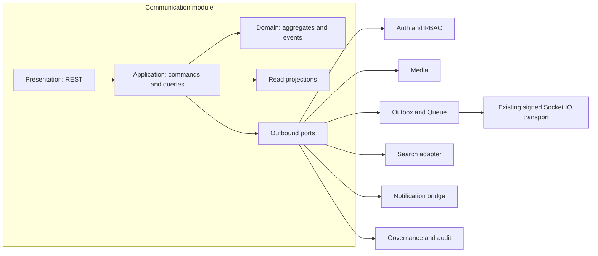
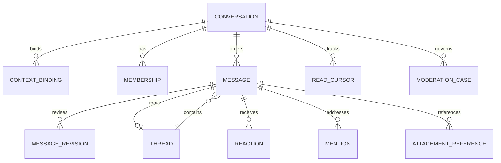

# Enterprise Communication Platform — Architecture Specification

**Status:** Proposed — Phase 1 architecture only
**Audience:** Architecture review board, senior engineering, security, SRE, and product teams
**Scope:** A reusable, tenant-isolated Communication module for Metrial BaseCode.

This is an architecture baseline only. It contains no migrations, source code, or implementation tasks.

## 1. Executive decision

Communication is a standalone module in the modular monolith. It owns conversations, memberships, messages, threads, reactions, attention state, moderation, retention, and the domain events describing them. It does not own identities, global roles, file bytes, notification channels, business records, or third-party credentials.

Laravel remains authoritative for Sanctum authentication, RBAC, tenant context, policies, transactions, queues, and the transactional outbox. The existing Socket.IO service remains a delivery edge. This design adds no parallel WebSocket server, broker, client-selected room model, or second source of truth.

| Concern                              | Authority and guarantee                                                  |
| ------------------------------------ | ------------------------------------------------------------------------ |
| Message, membership and policy state | MySQL transaction and authoritative REST read model                      |
| External webhooks/integrations       | Existing transactional outbox; at-least-once and idempotent              |
| Connected live update                | Existing Socket.IO delivery edge; at-most-once to a connected client     |
| Client recovery                      | Cursor-based REST synchronization after reconnect, gap, or resync signal |
| Presence, typing and recording       | Redis-backed ephemeral projection with expiry                            |

A live notification can be late, duplicated, or missed without losing a message. Socket payloads are change hints; clients synchronize truth through REST.

## 2. Platform contracts to preserve

- Laravel owns tenant-aware authorization, durable state, committed domain events, and policy decisions.
- The Socket.IO edge authenticates through Laravel with a short-lived internal assertion, exact allowed origins, signed internal calls, Redis adapter fanout, tenant-scoped rooms, and Redis duplicate claims.
- The realtime envelope has an ID, name, version, timestamp, tenant, audience, subject, safe payload, and correlation metadata. Communication extends its allowlist and schema registry; it never bypasses it.
- Redis Pub/Sub is availability-oriented, not a durable event log. The transactional outbox remains the durable integration mechanism.
- Auth, RBAC, Media, Governance, Integration, Webhook, and all business modules remain separate.

### Initial non-goals

Voice/video/SFU, end-to-end encryption, a dedicated search cluster, OCR, federation, and microservice extraction are future options, not implied work. Cross-tenant sharing is disabled by default. A conversation never substitutes another module's authorization.

## 3. Module boundary and ports

| Internal subdomain  | Owns                                                             | Does not own                           |
| ------------------- | ---------------------------------------------------------------- | -------------------------------------- |
| Conversation Access | types, lifecycle, context binding, visibility, member roles      | users or business resources            |
| Message Ledger      | append, revisions, deletion, expiry, quote, forward, mentions    | attachment bytes                       |
| Interaction         | threads, reactions, pins, drafts                                 | global emoji catalogue                 |
| Attention           | cursors, unread projections, mute                                | email, push, SMS delivery              |
| Trust & Compliance  | reports, moderation, legal hold, retention and archive decisions | enterprise audit storage               |
| Automation          | bot actors, templates, workflow intents                          | external credentials/webhook execution |

The application layer depends on ports, not other modules' models:

- ActorDirectory resolves active user/service actors from Auth.
- PermissionEvaluator combines RBAC with Communication policy.
- BusinessContextAuthorizer verifies access to a typed project, task, order, ticket, or customer context.
- AttachmentGateway asks Media for clean, finalized, tenant-owned assets.
- NotificationBridge creates intents in the notification capability.
- RealtimePublisher uses the existing signed platform publisher.
- SearchIndexer, ArchiveStore, and AuditSink are asynchronous, idempotent adapters.

No other module queries Communication tables directly. It uses a documented command, query, or integration event.

## 4. Ubiquitous language and bounded contexts

An **actor** is a user, bot, service identity, or future AI assistant. A **participant** is an actor allowed to see a conversation. A **conversation** is the access and ordering boundary. A **message** has a stable identity and revision history. A **thread** is discussion rooted at a message. A **context binding** is a typed link to a business resource, never a cross-module foreign key.

The module has six bounded contexts:

1. Conversation Access — profiles, lifecycle, membership and policy.
2. Message Ledger — ordered messages, revisions, deletion, mentions and references.
3. Interaction — threads, reactions, pins, drafts, typing and recording.
4. Attention — read/delivery cursors, unread and notification intents.
5. Trust & Compliance — reports, moderation, retention, archive and legal hold.
6. Automation & Integration — bots, templates, integration intents and future AI anti-corruption layers.

## 5. Conversation taxonomy

Conversation type is a registered capability profile, not a schema family. A profile sets participant rules, visibility, joining/posting policy, retention defaults, allowed context bindings, and enabled capabilities.

Initial profiles: direct, private_group, public_channel, private_channel, organization, department, branch, team, project, task, order, ticket, support, assistant, bot, broadcast, announcement, temporary, meeting, and voice_room.

A direct chat enforces a canonical participant set. A project conversation requires a typed context binding and delegates eligibility to Project. A broadcast permits only authorized publishers. New types need a profile strategy, policy, API/event contract, documentation, and tests—not new tables.

Voice rooms are a conversation capability only. Their future signaling/SFU design belongs to a realtime-media ADR.

## 6. Aggregate design

| Aggregate           | Invariants and responsibility                                               | Concurrency boundary                                  |
| ------------------- | --------------------------------------------------------------------------- | ----------------------------------------------------- |
| Conversation        | tenant, profile, title/avatar, lifecycle, settings, bindings, next sequence | one conversation with optimistic version              |
| Membership          | active/suspended/left state, conversation role, mute, join/leave facts      | one actor in one conversation                         |
| Message             | author, sequence, kind, content state, revision/delete/expiry, references   | one message; append reserves sequence transactionally |
| Thread              | root message and open/resolved state                                        | one root thread                                       |
| Reaction            | one active reaction per message, actor, key                                 | unique tuple and idempotent command                   |
| ModerationCase      | evidence references, state, decision and audited action                     | one case                                              |
| RetentionAssignment | effective policy/version and legal-hold override                            | conversation or tenant assignment                     |

Unread counts, reaction totals, participant totals, and search documents are projections. They may lag and are never authorization inputs.

### Entities and value objects

Entities: Conversation, ContextBinding, Membership, Message, MessageRevision, Thread, Reaction, Mention, AttachmentReference, Pin, Draft, ReadCursor, DeviceSyncCursor, ModerationCase, Report, RetentionAssignment, ArchiveManifest, BotInstallation, and Automation.

Value objects: TenantId, ConversationId, MessageId, ActorId, ConversationType, ConversationRole, MessageKind, MessageContent, ContentFormat, MessageSequence, ContextRef, RetentionRule, Expiry, MentionTarget, AttachmentRef, Cursor, IdempotencyKey, PresenceState, and ModerationDecision.

MessageContent is a validated discriminated payload. It may contain sanitized text, Markdown, rich text, or structured cards; it never accepts executable content or arbitrary HTML.

A reply records its conversation, thread root, and optional parent message. All replies use the conversation sequence, allowing unlimited nested presentation while retaining a deterministic order.

## 7. Message, attachment, and offline model

Every message has tenant, conversation, author actor, server timestamp, server-assigned conversation sequence, kind, current revision, lifecycle state, and idempotency identity.

The registry supports text, Markdown, rich text, media/document references, location, contact, system, bot, template, interactive, quote, forward, payment/order/task/approval cards, ephemeral, encrypted-placeholder, and future custom types. JSON/XML/custom payloads are schema-validated; unknown kinds are rejected or safely rendered as unsupported.

Editing appends MessageRevision rather than overwriting history. Soft delete produces a tombstone with the minimum retained audit fact. Hard purge follows retention only when legal hold is absent. Expiry is a server-scheduled durable transition.

### Ordering and retry

The server reserves sequence exactly once in the same transaction that writes the message. It is total order inside a conversation, not global order. A unique tenant/author/client-idempotency identity returns the original message after a mobile retry. A unique conversation/sequence makes sync deterministic.

Clients create temporary IDs while offline, send an idempotency key on reconnect, map the canonical server ID/sequence from the response, deduplicate IDs, and use server cursors for correction. Timestamp-only synchronization is prohibited.

### Attachments

Communication stores AttachmentReference metadata, not file bytes or trusted URLs. Media owns upload sessions, chunking/resume, checksums, MIME validation, virus scanning, transcoding, previews, CDN delivery, and object lifecycle.

Send-message accepts only a tenant-owned, clean, finalized Media asset. Pending attachment messages are allowed only if product policy accepts that state; they are never presented as ready before scan/finalization. Scan failure makes the reference unavailable and emits a safe state update.

## 8. Policy, RBAC, and tenancy

Every query begins in tenant scope and participant visibility. Every command checks tenant RBAC, conversation role, profile policy, membership state, and where relevant BusinessContextAuthorizer.

| Area         | Permissions                                                                    |
| ------------ | ------------------------------------------------------------------------------ |
| Conversation | communication.conversations.create, rename, archive, lock                      |
| Membership   | communication.members.invite, remove, roles.assign                             |
| Message      | communication.messages.create, edit_own, edit_any, delete_own, delete_any, pin |
| Content      | communication.attachments.upload, bots.manage, automations.manage              |
| Governance   | communication.moderation.manage, retention.manage, archive.export, audit.read  |

Conversation roles are owner, moderator, member, guest, publisher, and bot. They limit a particular conversation but never replace global RBAC. Removing membership immediately denies API access, prevents future subscriptions, and schedules socket resynchronization/disconnect.

Everything durable has tenant_id and tenant-leading indexes. Repository operations require TenantId; there is no unscoped module finder. Redis/cache/rate-limit/idempotency/search/archive keys are tenant-prefixed. Queue work carries and resets the established tenant context. Support/admin operations require explicit tenant scope and audit.

Block is a server-enforced bilateral policy evaluated before direct conversation creation, invitation, mention, and delivery—not a UI filter.

## 9. Domain, integration, and realtime event catalog

Domain events are raised only after aggregate invariants pass and are written through the transactional outbox. Consumers are idempotent by event ID and receive references/safe snapshots rather than unnecessary content.

| Family       | Events                                                                                                                                |
| ------------ | ------------------------------------------------------------------------------------------------------------------------------------- |
| Conversation | ConversationCreated, ConversationRenamed, ConversationArchived, ConversationRestored, ConversationLocked, ConversationSettingsChanged |
| Membership   | ParticipantJoined, ParticipantLeft, ParticipantRemoved, ParticipantRoleChanged, ConversationMuted                                     |
| Message      | MessageCreated, MessageEdited, MessageDeleted, MessageExpired, MessagePinned, MessageUnpinned, MessageForwarded                       |
| Interaction  | ThreadCreated, ThreadResolved, ThreadReopened, ReactionAdded, ReactionRemoved, MentionCreated, DraftSaved                             |
| Attention    | MessageDelivered, ConversationReadUpTo, UnreadProjectionUpdated                                                                       |
| Attachment   | AttachmentReferenced, AttachmentAvailable, AttachmentRejected                                                                         |
| Trust        | MessageReported, ModerationActionApplied, RetentionApplied, LegalHoldApplied, ConversationArchivedToStore                             |
| Automation   | BotInvoked, AutomationTriggered, AutomationCompleted, AutomationFailed                                                                |

Integration contracts are versioned independently of PHP classes. Additive change is compatible; a breaking change creates a new version/name and overlap window.

### Socket.IO design: preserve the delivery edge

The default Socket.IO namespace and existing generic realtime event envelope remain. A new Communication namespace is rejected because it would duplicate authentication, recovery, rate limits, and Redis-adapter semantics.

Communication adds a logical communication.* event family to the existing schema registry:

- communication.conversation.created, updated, archived, locked
- communication.membership.joined, left, role_changed
- communication.message.created, updated, deleted, expired, pinned
- communication.reaction.added, removed
- communication.thread.created, updated, resolved
- communication.read.updated and communication.unread.updated
- communication.presence.changed and communication.typing.started, stopped

Every event has an event ID, strict schema, version, tenant, allowlisted audience, correlation data, and minimum safe payload. Events normally contain IDs, sequence, revision, and small rendering-safe summaries; REST remains the way to obtain authoritative content.

### Rooms and authorization

Existing automatic rooms remain tenant and tenant-user rooms. Communication adds a derived resource room:

    tenant:{tenant-id}:conversation:{conversation-id}

A client asks to subscribe by conversation resource ID; it never provides a room name. Laravel's existing signed internal authorization boundary validates assertion, tenant, active membership, visibility/lock state, and Conversation policy before the Socket.IO edge joins the room. The resource-type allowlist is extended deliberately to conversation; thread rooms are deferred until measurement proves they are required.

| Update                                 | Audience                                             |
| -------------------------------------- | ---------------------------------------------------- |
| Message, reaction, thread or pin state | authorized conversation resource room                |
| Private membership or unread changes   | affected user room; conversation room only when safe |
| Authorized tenant-wide announcement    | tenant room under explicit broadcast profile         |
| Session revocation                     | existing user room behavior                          |
| Typing/presence                        | authorized conversation room                         |

Typing, recording, and presence use a constrained ephemeral control path: current assertion, server-side conversation authorization, bounded schema, per-user/socket rate limits, short Redis TTL, and Redis-adapter fanout. Clients cannot publish arbitrary names, tenant IDs, or rooms. Reliable mutations always use REST first.

On ready, reconnect, resync_required, event-version failure, or a sequence gap, the client calls cursor synchronization. It retains recent event IDs for dedupe and never assumes a missed socket event means a missed message.

## 10. Presence, delivery, and receipts

Presence is a Redis projection, not a database write per heartbeat. Tenant-prefixed user/device/session leases have a short TTL and heartbeat renewal. Graceful disconnect removes a lease; loss expires it. A user-level aggregate yields online, away, busy, invisible, or offline plus optional custom status. A queued projector writes meaningful last_seen changes only. Visibility is policy-controlled.

Typing/recording is coalesced per conversation/actor. Start refresh is rate limited; stop, disconnect, removal, or TTL clears it. It is advisory and never an audit record.

Do not create a delivery/read row for every recipient and message. The canonical state is membership last_read_sequence and last_delivered_sequence, optionally device cursors with derived user maximum. Unread is derived from latest visible sequence and read cursor. Cursor updates are monotonic using greatest(existing, requested), so retries are safe.

Individual receipt rows are optional for small or compliance-specific conversations with retention limits. Broadcast metrics are aggregate projections, not millions of receipt writes.

## 11. Database, storage, and lifecycle

The eventual logical schema has conversation, context_binding, membership, message, message_revision, thread, reaction, mention, attachment_reference, pin, draft, read_cursor, device_sync_cursor, moderation, retention, archive, outbox, and projection tables.

A dedicated data ADR must settle physical IDs against the platform's existing convention. For new high-volume records, the target is time-sortable UUIDv7 stored compactly with application conversion, but no cross-platform ID rewrite is permitted.

Essential indexes:

- tenant, conversation, sequence descending for timeline/sync;
- tenant, actor, membership state, updated time for inbox;
- unique conversation, actor membership;
- unique conversation, sequence and author idempotency for message;
- thread, conversation, sequence for replies;
- unique message, actor, reaction key;
- tenant, mentioned actor, sequence for mentions.

Same-module foreign keys protect integrity where they do not block archive/partition operations. Cross-module references are typed IDs validated through ports.

Begin with one writer, read replicas for projections, and measured time partitioning for append-heavy messages only after real retention/query evidence. At larger scale, a tenant-to-shard directory routes each tenant; conversations do not span shards, hot-path queries never join shards, and analytics comes from a warehouse rather than production cross-tenant queries.

Retention resolution order is legal hold, explicit conversation policy, profile default, tenant default, then platform minimum. Archive creates an encrypted, manifest-verified immutable object and pointer. Purge is delayed, idempotent, and audited. Legal hold blocks alteration/purge but never grants viewing access.

## 12. Search, notifications, bots, and integrations

Search is a projection, never an authorization source. Initial tenant-scoped database search can be used where appropriate; the target adapter supports OpenSearch/Elasticsearch. Documents contain tenant, conversation, visibility/policy version, sequence, lifecycle, and retention state. Search restricts tenant and candidate conversation access before result-level policy filtering. Delete/moderation/retention events tombstone or purge idempotently, with reconciliation for index drift.

The filter grammar is allowlisted: conversation, sender, mention, hashtag, date, message kind, attachment, edited/deleted, pinned, and unread. Tenants never receive arbitrary search DSL.

NotificationBridge consumes committed events and creates idempotent notification intents after preference, quiet-hour, mute, and mention-priority evaluation. Communication does not send email, push, SMS, or WhatsApp directly.

Business modules request/bind a typed ContextRef and retain ownership of their records and policies. Bots/AI are least-privilege actors with explicit memberships, capabilities, rate limits, attributable messages, and audit. External adapters verify signatures, map external IDs to commands, use the outbox, and never own the database transaction. AI retrieval is policy-filtered and retention-eligible.

## 13. Security and compliance

Transport encryption, encryption at rest, Media scanning, signed internal APIs, replay prevention, tenant middleware, and platform audit capabilities are reused. Rich text is server-sanitized and rendered with a strict allowlist. Logs, metrics, traces, socket events, and audit payloads exclude bearer tokens, assertions, raw secrets, and unnecessary message bodies.

Moderation uses synchronous hard blocks and asynchronous scanning. Flood/spam limits exist at REST, ephemeral socket, and queue boundaries. Report cases retain only authorized evidence references. Mute, ban, shadow-ban, lock, and archive are server-side policy states.

Future E2EE requires a separate security/key-management ADR. It conflicts with server-side search, moderation, bots, previews, export, and some retention workflows; it is not a configuration switch.

## 14. Scale, observability, and disaster recovery

The target is 10+ million users, not an unbounded number of permanently connected sockets in one cluster.

- Keep the write path narrow: authorize, reserve sequence, append, outbox, commit.
- Queue scan, thumbnails, search, notification, archive, analytics, and moderation.
- Scale app, queue categories, and Socket.IO independently; preserve current Redis adapter architecture.
- Enforce tenant, actor, conversation, IP, payload, attachment, and broadcast quotas.
- Treat broadcast fanout as a priced/capped capability with staged delivery.
- Cache only safe projections; REST cursor sync remains correction.
- Apply backpressure and shed noncritical transient state before durable commands.

Structured logs/traces carry correlation, causation, and trace IDs. Minimum metrics: append latency/lock contention, idempotency replay, cursor gaps, outbox age, queue retry/DLQ, Socket.IO connections/denials/resyncs/adapter failures, presence expiry, search/index lag, archive/retention backlog, storage growth, and tenant-isolation rejects.

| Failure              | Expected recovery                                                               |
| -------------------- | ------------------------------------------------------------------------------- |
| Socket node loss     | reconnect to healthy node; API cursor sync                                      |
| Redis Pub/Sub loss   | live hints may be lost; MySQL/outbox persists; sync repairs                     |
| Redis presence loss  | presence becomes unknown/offline after TTL; no message loss                     |
| Queue outage         | writes commit; asynchronous projections replay from outbox                      |
| Search/Media outage  | timeline works; search degrades, attachments remain pending                     |
| Database writer loss | established failover; reject writes rather than split-brain sequence allocation |
| Region loss          | encrypted backup/PITR, safe outbox replay, forced client sync                   |

RPO/RTO, residency, backup, archive restore, key recovery, queue replay, and failover tests must be agreed per tenant tier. Quarterly DR exercises must confirm tenant isolation and legal-hold preservation.

## 15. Test, CI/CD, and release evidence

| Layer       | Required evidence                                                                    |
| ----------- | ------------------------------------------------------------------------------------ |
| Domain      | aggregate invariants, policy matrices, revision/order/idempotency                    |
| API         | validation, authorization, tenant isolation, cursor behavior, Scramble coverage      |
| Persistence | indexes/query plans, concurrent append/cursor, retention/archive                     |
| Contract    | REST, outbox and port schemas/version compatibility                                  |
| Realtime    | strict schemas, room authorization, reconnect/resync, existing two-node cluster gate |
| Security    | IDOR/tenant escape, replay, rate limits, XSS, attachment lifecycle                   |
| Performance | hot rooms, inbox/sync/search, queue saturation, connection churn                     |
| Chaos/DR    | Redis/node/queue/db/search/media loss, duplicate events, restore                     |

CI runs static analysis, formatting, unit/feature/contract/realtime tests, OpenAPI generation/validation, dependency/security scans, and later migration dry-run. Releases are additive and feature-flagged per tenant, with canary SLO gates and rollback. Future schema work follows expand, backfill, dual-read/write where needed, contract; never a big-bang rewrite.

## 16. 10+ million user architecture review

| Rejected weakness                        | Control                                                      |
| ---------------------------------------- | ------------------------------------------------------------ |
| Per-message per-recipient receipts       | monotonic membership cursors; optional small-room receipts   |
| Client-selected socket rooms             | Laravel-authorized server-derived rooms only                 |
| Redis Pub/Sub as truth                   | MySQL plus outbox authoritative; cursor sync                 |
| Unbounded message table                  | sequence indexes, measured partitioning, archive, shard plan |
| Files/URLs stored as authority           | Media reference and scan/finalization gate                   |
| Chat coupled to ticket/order/user tables | typed context refs and ports                                 |
| Search before authorization              | tenant/candidate/result policy filtering                     |
| E2EE treated as free                     | dedicated key-management product decision                    |
| Unbounded broadcast fanout               | profile capability, quotas, staged delivery                  |
| Timestamp-only sync                      | server sequence, opaque cursors, revisions                   |

The principal remaining risks are hot conversations, fanout, rich-text/attachment abuse, and residency. They require explicit product quotas, realistic fanout load tests, strict content/Media controls, and a tenant-to-region/shard directory before regulated multi-region deployment.

## 17. Phases and approval gates

No implementation begins before this Phase 1 design is approved.

1. **Phase 1 — architecture:** approve language, profiles, compliance class, limits, SLO/RPO/RTO, and data-ID ADR.
2. **Phase 1.5 — contract blueprint:** approve the REST, logical database, durable-event, and Socket.IO contracts in [the contract blueprint](contract-blueprint.md). This is a mandatory gate before implementation.
3. **Phase 2 — durable core:** Conversation, Membership, Message, cursor sync, policy contracts.
4. **Phase 3 — realtime projection:** allowlisted Communication schemas, authorized conversation subscriptions, recovery evidence; preserve existing transport.
5. **Phase 4 — interaction:** threads, reactions, mentions, mute, notification bridge, presence/typing.
6. **Phase 5 — enterprise controls:** Media lifecycle, search, moderation, retention/archive/export/audit.
7. **Phase 6 — scale/ecosystem:** sharding, analytics, automation/bots, federation, AI, voice/video ADRs.

Each phase requires security and architecture review, tenancy/authorization tests, load evidence, runbook, OpenAPI/event-contract update, and an explicit rollback plan.

## 18. Decisions required before Phase 2

1. Which retention, legal-hold, residency, export, and audit obligations apply to the first tenant cohort?
2. Which conversation profiles and participant/fanout/attachment limits are in the first product slice?
3. Is compact UUIDv7 approved for new Communication tables, or must the current platform representation be used initially?
4. What is the canonical notification contract and initial channel responsibility?
5. What are the policies for blocked users, guests, support agents, bots, and shared identities?
6. What SLO/RPO/RTO and tenant-tier quotas are contractual?

Until these decisions are made, this document guides implementation without making irreversible data or compliance assumptions.
