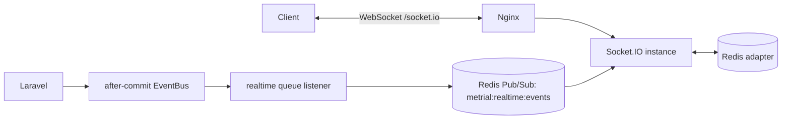

# Socket.IO architecture

Laravel remains the owner of authentication, authorization, tenancy, business
state, transactions and domain events. `services/realtime` is a delivery edge:
it authenticates a connection through Laravel, joins only server-derived rooms,
then forwards trusted event envelopes to connected clients.

The Redis adapter coordinates Socket.IO instances. It is not the Laravel event
transport. Laravel uses a dedicated signed Pub/Sub channel for that transport.

Delivery is at-least-once from the Laravel queue to Redis and at-most-once to a
currently connected client. Clients must deduplicate by event `id` and refetch
authoritative API data after `realtime:ready` or `realtime:resync_required`.
The cluster-wide `SET NX EX` claim prevents every Pub/Sub subscriber from
rebroadcasting the same ID through the Socket.IO adapter. This remains
availability-oriented: a process crash after claiming an ID but before emitting
can lose that live event, and clients must resynchronize.

The key is `metrial:realtime:dedupe:<event-id>` and its default TTL is 300
seconds (`REALTIME_DEDUPE_TTL_SECONDS`). This bounds retry duplicate protection
to the maximum supported retry window; an event replayed after expiry is a new
live broadcast. The automated two-node gate uses a short three-second TTL only
inside its isolated Compose overlay.

Run `cd services/realtime && npm run test:integration:cluster` to start
Laravel, MySQL, Redis, the queue worker, and two deterministic Node instances.
It proves Redis adapter propagation and distributed duplicate suppression using
real Sanctum authentication and Laravel's signed publisher.

Only payment and wallet events are mapped initially. An event without a tenant
is dropped rather than being broadcast globally.

Socket authorization expires after `REALTIME_SESSION_TTL_SECONDS` (300 seconds
by default). A missed Redis revocation can therefore leave an existing socket
connected for at most that interval; reconnect and new resource subscriptions
revalidate Laravel's token and policy state.
