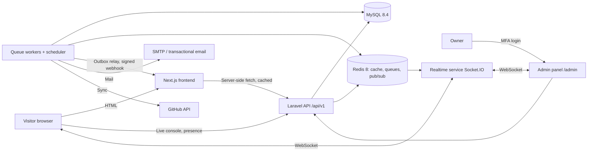
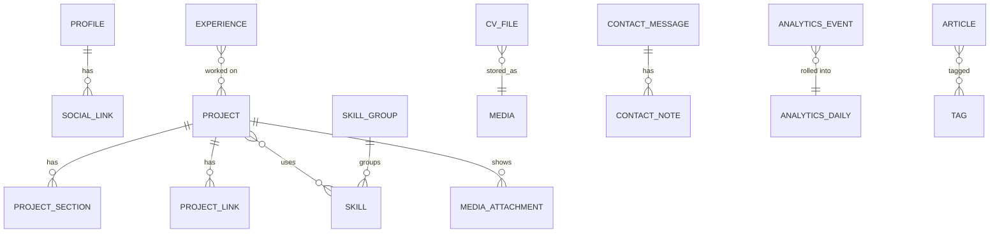

# Software Requirements Specification: Backend

| | |
|---|---|
| **System** | Metrial Portfolio API (`backend-api/`) |
| **Document** | SRS-BE v1.0 |
| **Date** | 2026-09-15 |
| **Owner** | Kareem Sabry Elsayed |
| **Traces to** | [BRS](BRS.md) · [PRD](PRD.md) · [SEO Strategy](SEO.md) |
| **Consumed by** | [SRS Frontend](SRS-frontend.md) · [Plan Backend](plan-backend.md) |

---

## 1. Introduction

### 1.1 Purpose

This document specifies the backend of the portfolio platform: the content API, admin panel, contact
pipeline, analytics, revalidation, and live-showcase endpoints. It is precise enough to implement and test against.

### 1.2 Scope

The backend is built **on top of the existing Metrial Base Code** (Laravel 12 modular monolith) in
`backend-api/`. It adds portfolio-specific modules, reuses base modules, and disables unused ones.

### 1.3 Definitions

| Term | Meaning |
|---|---|
| **Base** | The existing Metrial Base Code: modules, conventions, and Docker platform |
| **Public API** | Unauthenticated, read-mostly endpoints consumed by the frontend and the live console |
| **Admin** | Owner-only management panel |
| **Envelope** | The base's uniform JSON response `{ success, message, data, meta }` / `{ success, error, meta }` |
| **Outbox** | The base's transactional outbox that relays domain events to signed outgoing webhooks |
| **Translatable field** | JSON column `{ "en": "…", "ar": "…" }` with fallback to `en` |
| **Confidentiality** | Project visibility level: `public`, `summary_only`, `hidden` |

### 1.4 References

`backend-api/README.md`, `backend-api/ARCHITECTURE.md`, `backend-api/docs/realtime/*`, `backend-api/docs/api/README.md`.

## 2. Overall description

### 2.1 System context



### 2.2 Module map

| Module | Status | Use in the portfolio |
|---|---|---|
| Shared | **Reuse** | Envelope, locale negotiation (en/ar, `meta.direction`), `HasTranslations`, EventBus + outbox, circuit breaker, audit trait |
| Auth | **Reuse** | Owner login, MFA, session management. Public registration **disabled**. |
| RBAC | **Reuse** | Roles `super-admin` (owner) and optional `editor`; `resource.action` permissions for new resources |
| Governance | **Reuse** | Audit logs for every content change; Settings (site settings); Feature flags (section toggles) |
| Media | **Reuse** | Project images and videos, CV PDFs, OG source images; presign → upload → confirm pipeline; virus scan |
| Webhook | **Reuse** | Outgoing signed webhook to the frontend revalidation endpoint |
| Integration | **Reuse** | `ApiClient` + circuit breaker for the GitHub API; mail/notification channels |
| Territory | Internal only | Country lookup for analytics (country code only) |
| Currency | Internal only | Not used by portfolio features |
| **Portfolio** | **New** | Profile, experiences, projects, skills, education, certificates, testimonials |
| **Contact** | **New** | Contact submissions, spam scoring, inbox workflow |
| **Analytics** | **New** | Cookieless events and aggregates |
| **Showcase** | **New** | Live-console allowlist, system status, presence, GitHub stats |
| **Insights** | **New (v1.1)** | Articles (main long-tail SEO lever) |
| Payment | **Disabled** | `MODULE_PAYMENT_ENABLED=false` |
| Wallet | **Disabled** | `MODULE_WALLET_ENABLED=false` |
| Communication | **Disabled** | `MODULE_COMMUNICATION_ENABLED=false` |
| Integration OAuth | **Disabled** | `MODULE_INTEGRATION_OAUTH_ENABLED=false` |

New modules follow the base convention `modules/{Module}/{Domain,Infrastructure,Presentation}`, register
their provider in `bootstrap/providers.php`, and gate their routes with a `config/modules.php` flag.

### 2.3 Operating environment

PHP 8.3+ (container runs 8.4), Laravel 12, MySQL 8.4, Redis 8, Node 22 (realtime service), Docker Compose
(`compose/` dev and prod overlays via `Makefile`), Linux VPS in production.

### 2.4 Design constraints

- **DC-1** Follow the base's layering and dependency rules (ARCHITECTURE.md). Cross-module communication goes through events and contracts.
- **DC-2** All public responses use the base envelope and stable error codes.
- **DC-3** Money, wallet, and payment code paths stay untouched and disabled.
- **DC-4** Admin UI: **FilamentPHP**, on the version compatible with Laravel 12, verified at install. It matches the owner's CV skills and gives fast CRUD. Fallback: a Next.js admin against an authenticated admin API.
- **DC-5** No proprietary employer code or data is stored or served.

## 3. Functional requirements

Format: **FR-BE-xx**, then the requirement, then *Traces* (PRD IDs). "shall" means mandatory.

### 3.1 Portfolio content

| ID | Requirement | Traces |
|---|---|---|
| FR-BE-01 | The system shall store a single **Profile** with translatable name, headline, summary, location, and about story; availability status (`open`, `open_to_relocation`, `not_available`) with translatable text; email; phone plus `phone_visible` (default `false`); and social links. | PR-A1, PR-C4, PR-E5 |
| FR-BE-02 | The system shall store **Experiences** with company, translatable role, start month, nullable end month (`null` = Present), location, employment type, translatable highlights (ordered list), sort order, and linked projects. | PR-C1, PR-A6 |
| FR-BE-03 | The system shall store **Projects** with a unique slug, translatable title, tagline, and summary, domain, type, featured flag, sort order, status (`draft`, `published`), confidentiality (`public`, `summary_only`, `hidden`), period, role, ordered **sections** (translatable heading plus Markdown body, with section types `context`, `role`, `architecture`, `flows`, `challenges`, `outcome`), **links** (Play Store, App Store, website, GitHub), **media** (via the Media module), **technologies** (many-to-many skills), optional architecture diagram JSON, and flow JSON. | PR-B1–B5, PR-B7 |
| FR-BE-04 | For `summary_only` projects the API shall return only title, tagline, summary, domain, technologies, and period, **never** sections, media, or diagrams. `hidden` and `draft` projects shall never be returned by any public endpoint, including counts. | PR-B7, BR-03 |
| FR-BE-05 | The system shall store **Skills** grouped into **SkillGroups** (the CV's 7 groups), each with sort order, optional icon key, and a computed `project_count` (published, non-hidden projects only). | PR-A7, PR-C2 |
| FR-BE-06 | The system shall store **Education**, **Certificates** (issuer, translatable title, date, optional credential URL), and **Testimonials** (author, role, company, translatable quote, published flag, consent flag). | PR-C3 |
| FR-BE-07 | The system shall compute **proof stats** on read: shipped platforms (published projects), companies (distinct experiences), public apps (project links of store type), and professional-experience start date (earliest non-internship experience). No stored or manually typed metrics. | PR-A4, BR C-4 |
| FR-BE-08 | Every content model shall use the `Auditable` trait, so creates, updates, and deletes appear in the Governance audit log. | PR-H1 |
| FR-BE-09 | Seeders shall load the content inventory in PRD §7 as the initial data, idempotently. | PRD §7 |

### 3.2 Public API

| ID | Requirement | Traces |
|---|---|---|
| FR-BE-10 | The system shall expose the read endpoints in §5.2 without authentication, localized through `?lang=` or `Accept-Language` (en/ar), with `meta.locale` and `meta.direction`. | PR-G1 |
| FR-BE-11 | Public read responses shall be cached in Redis per resource and locale, and invalidated by content-change events (§3.6). | NFR-P1 |
| FR-BE-12 | Public read responses shall include `ETag` and `Cache-Control: public, max-age=60, stale-while-revalidate=600`, and honor `If-None-Match` with `304`. | NFR-P1 |
| FR-BE-13 | Public endpoints shall be rate-limited per IP: reads 120/min (`api`), live console 30/min (`showcase`), contact 5/hour (`contact`), analytics 60/min (`analytics`). Responses include `X-RateLimit-Limit` and `X-RateLimit-Remaining`. | PR-F1, NFR-S3 |
| FR-BE-14 | CORS shall allow only the configured frontend origins (`CORS_ALLOWED_ORIGINS`), limited to `GET, POST, OPTIONS`. | NFR-S4 |
| FR-BE-15 | The public API shall be documented with **Scramble** OpenAPI 3.1 exports in `artifacts/openapi/`, regenerated in CI and on release. | PR-F1 |

### 3.3 Admin

| ID | Requirement | Traces |
|---|---|---|
| FR-BE-20 | The admin panel shall be served at `/admin`, reachable only by users with the `super-admin` or `editor` role; **MFA shall be mandatory** for all admin users. | PR-H1 |
| FR-BE-21 | The admin shall provide create, read, update, delete for every content model in §3.1, with English and Arabic inputs side by side, Markdown editing with preview for project sections, drag-and-drop ordering, and publish/draft toggles. | PR-H2, PR-H3 |
| FR-BE-22 | The admin shall provide media upload through the Media module pipeline (presign, upload, confirm, verify). Accepted: images (JPEG, PNG, WebP, AVIF ≤ 5 MB), video (MP4/WebM ≤ 50 MB), PDF (CV ≤ 5 MB). Image variants shall be generated (thumbnail, card, full, WebP). | PR-B5, PR-D2 |
| FR-BE-23 | The admin shall manage **Site Settings** through Governance Settings: availability, relocation flag, phone visibility, social links, default SEO title and description per locale, contact auto-reply toggle, and notification email. | PR-H4 |
| FR-BE-24 | The admin shall manage **section feature flags** through Governance Feature Flags: `showcase.console`, `showcase.presence`, `showcase.github`, `home.skills_constellation`, `insights`. The public `GET /site` endpoint exposes their on/off state. | PR-H4 |
| FR-BE-25 | Public self-registration shall be disabled; admin users are created by an artisan command (`portfolio:create-owner`). | PR-H1 |
| FR-BE-26 | The admin dashboard shall show 7-day and 30-day totals for page views, unique visitors, CV downloads, contact submissions, top 5 projects, and top referrer domains. | PR-H6 |

### 3.4 CV

| ID | Requirement | Traces |
|---|---|---|
| FR-BE-30 | The owner shall upload CV PDFs per locale; exactly one CV per locale is marked `current`, and earlier versions are retained. | PR-D2, PR-D4 |
| FR-BE-31 | `GET /api/v1/cv?lang=` shall record a `cv_download` event and respond `302` to a short-lived signed download URL for the current CV (English fallback if there is no Arabic CV). File name: `Kareem_Sabry_Backend_Software_Engineer_CV.pdf`. | PR-D1, PR-D3 |

### 3.5 Contact

| ID | Requirement | Traces |
|---|---|---|
| FR-BE-40 | `POST /api/v1/contact` shall accept `name` (2–100), `email` (RFC, DNS check in production), `inquiry_type` (`full_time`, `freelance`, `consulting`, `other`), `message` (20–5000), `lang`, `website` (honeypot, must be empty), `elapsed_ms` (form fill time), and `challenge_token`. | PR-E1 |
| FR-BE-41 | The system shall reject submissions that have a filled honeypot, `elapsed_ms < 3000`, or an invalid bot-challenge token, returning a generic success response to bots (no signal). The challenge is verified server-side through the Integration `ApiClient` with circuit breaker. | PR-E2 |
| FR-BE-42 | The system shall compute a spam score (link count, blocklisted terms, repeated submissions from the same email or IP hash within 24 h). Score ≥ threshold → status `spam`, no owner email. | PR-E2 |
| FR-BE-43 | An accepted submission shall be stored with status `new` and publish a `ContactMessageReceived` domain event. Listeners (queued, after commit): (a) send the owner an email; (b) push a realtime notification to admin users; (c) if enabled, send the visitor an auto-reply in their `lang`. | PR-E3, PR-E4 |
| FR-BE-44 | Owner notification shall be delivered within 2 minutes under normal operation; failed mail jobs retry with backoff (1 m, 5 m, 30 m) and surface in the admin as failed. | PR-E3, BR-06 |
| FR-BE-45 | The admin inbox shall support statuses `new → read → replied → archived`, marking `spam` / `not spam`, internal notes, and a "reply by email" link (`mailto:`). | PR-E6 |
| FR-BE-46 | Contact data retention: `spam` purged after 30 days, `archived` after 365 days, by scheduled job. The IP is stored only as a salted hash. | NFR-PR1 |

### 3.6 Revalidation (content → frontend)

| ID | Requirement | Traces |
|---|---|---|
| FR-BE-50 | Any create, update, delete, publish, or reorder of public content shall publish a `PortfolioContentChanged` event (`StoredInOutbox`) carrying `{ resource, ids, slugs, tags, locales }`. | PR-H5 |
| FR-BE-51 | Tags follow the contract shared with the frontend: `profile`, `site`, `experiences`, `skills`, `credentials`, `projects`, `project:{slug}`, `stats`, `insights`, `article:{slug}`, `seo`, `redirects`. | PR-H5 |
| FR-BE-52 | The outbox relay shall deliver the event to the registered frontend `WebhookEndpoint` as a signed POST (`X-Webhook-Signature: t=<ts>,v1=<hmac>`), with the base retry policy (1 m / 5 m / 30 m / 2 h). Events for the same tags within 10 s shall be coalesced into one delivery. | PR-H5, BR-08 |
| FR-BE-53 | The admin shall show the last revalidation delivery status and provide a **"Revalidate all"** action that emits all tags. | PR-H5 |

### 3.7 Analytics

| ID | Requirement | Traces |
|---|---|---|
| FR-BE-60 | `POST /api/v1/analytics/events` shall accept a batch (≤ 20) of events from PRD §10, each with `name`, `path`, `lang`, `referrer`, and `props`; unknown names and props are rejected. | PR-I1 |
| FR-BE-61 | The server shall derive `device_class` from the User-Agent, `country_code` from an IP-to-country lookup, and `visitor_hash = sha256(ip + ua + daily_salt)`. The raw IP and full User-Agent shall **never** be persisted. The daily salt rotates at 00:00 UTC and old salts are deleted. | PR-I2 |
| FR-BE-62 | Requests with `DNT: 1` or `Sec-GPC: 1` shall be counted only as anonymous aggregate page views, with no visitor hash. | PR-I3 |
| FR-BE-63 | A scheduled job shall roll up raw events into daily aggregates hourly; raw events are deleted after 90 days. | PR-H6 |

### 3.8 Showcase (live backend)

| ID | Requirement | Traces |
|---|---|---|
| FR-BE-70 | `GET /api/v1/showcase/endpoints` shall return the **allowlist** of endpoints the live console may call (method, path template, description, example params). Only `GET` public endpoints are allowlisted. | PR-F1 |
| FR-BE-71 | Every response shall carry `X-Request-Id` (existing request-id middleware) and `Server-Timing: app;dur=<ms>, db;dur=<ms>, cache;desc=hit/miss`, so the console can display timings. | PR-A3, PR-F1 |
| FR-BE-72 | `GET /api/v1/showcase/status` shall return database and cache health, queue heartbeat age (from the scheduler writing a Redis heartbeat every minute), last outbox relay time, last GitHub sync time, app version (git SHA), and uptime since the last deploy. No hostnames, IPs, versions of infrastructure software, or secrets. | PR-F2 |
| FR-BE-73 | **Presence:** the realtime service shall accept **anonymous public** connections in a dedicated `public` namespace with a new allowlisted audience `public`. It tracks online count and broadcasts `presence.count` (at most once per 5 s) and `activity.project_view` (`{ slug, country_code }`, at most one per 3 s). Anonymous sockets can only receive; they cannot publish. | PR-F3 |
| FR-BE-74 | The new realtime event names (`presence.count`, `activity.project_view`, `contact.received` for admins) shall be added to the event contract with strict schemas and tests, following `docs/realtime/event-contract.md`. | PR-F3, PR-E3 |
| FR-BE-75 | **GitHub sync:** a scheduled job (hourly) shall fetch the public profile, pinned or top repositories, language distribution, and the contribution calendar for `KaremMetrial` through `ApiClient` with circuit breaker; store a snapshot; and serve it from `GET /api/v1/showcase/github`. On API failure the last snapshot is served with `meta.stale=true`. The token lives in `.env` only. | PR-F6 |
| FR-BE-76 | `GET /api/v1/showcase/engineering` shall return verifiable base-code facts computed at deploy time: module count, test count, route count, and last successful CI run. | PR-F5 |

### 3.9 Site and SEO support

| ID | Requirement | Traces |
|---|---|---|
| FR-BE-80 | `GET /api/v1/site` shall return settings needed on every page: availability, relocation flag, social links, visible contact channels, feature flags, SEO defaults, supported locales, and the current CV `updated_at`. | PR-A1, PR-H4 |
| FR-BE-81 | `GET /api/v1/sitemap` shall return all public URLs (pages, projects, articles) per locale with an accurate `updated_at` that also changes when related data changes (sections, links, media, skills), plus cover image URLs. | PR-J1, PR-J7 |
| FR-BE-82 | **SEO fields:** every public page type (home, about, projects index, experience, contact, under-the-hood) and every project and article shall have per-locale `seo_title` (≤ 60), `seo_description` (140–160), optional `og_image` (Media), and `noindex` flag, editable in the admin with live character counters and a Google-result preview. Empty fields fall back to the [SEO.md §6](SEO.md#6-on-page-templates) templates on the frontend. Returned as `seo` in page and project responses, and from `GET /api/v1/seo/pages/{page}`. | PR-J5 |
| FR-BE-83 | **Slug history:** changing a project or article slug shall store the old slug in `slug_redirects` (type, old, new, locale-independent) and never reuse it for another item. `GET /api/v1/redirects` returns all active redirects (cached, tag `redirects`); redirect chains are collapsed on write (A→B, B→C becomes A→C, B→C). | PR-J6 |
| FR-BE-84 | **Entity data:** Site Settings shall include `person.alternate_names` (en/ar list), `person.same_as` (profile URLs), and `person.knows_about` override, exposed in `GET /site` for structured data. | PR-J3 |
| FR-BE-85 | **IndexNow:** after a publish, update, or unpublish of a public URL, a queued job shall submit the affected URLs (both locales) to the IndexNow endpoint using `INDEXNOW_KEY`, coalesced per 10 minutes; the key file is served by the frontend at `/{key}.txt`. Failures are logged, not retried more than 3 times. | PR-J7 |
| FR-BE-86 | **SEO health checks** in the admin dashboard: lists projects or articles missing SEO description, cover alt text, or Arabic translation, and duplicate SEO titles. | PR-J5 |

### 3.10 Insights (v1.1)

| ID | Requirement | Traces |
|---|---|---|
| FR-BE-90 | The system shall store Articles with slug, translatable title, excerpt, and Markdown body, tags, cover media, `published_at`, and a computed reading time; plus `GET /insights/articles` (paginated, tag filter) and `GET /insights/articles/{slug}`. | PR-K1 |

## 4. Data model



Key tables (all ids UUID via `HasUuid`, timestamps; translatable = JSON):

| Table | Key columns |
|---|---|
| `profiles` | `name`*, `headline`*, `summary`*, `about`*, `location`*, `availability` enum, `availability_text`*, `open_to_relocation` bool, `email`, `phone`, `phone_visible` bool |
| `social_links` | `profile_id`, `platform` enum(linkedin, github, x, email, website), `url`, `sort` |
| `experiences` | `company`, `company_url`, `role`*, `employment_type` enum(full_time, internship, contract, freelance), `location`*, `started_on` date, `ended_on` date null, `highlights`* (JSON array per locale), `sort` |
| `projects` | `slug` unique, `title`*, `tagline`*, `summary`*, `domain` enum, `type` enum(company, freelance, personal, open_source), `role`*, `started_on`, `ended_on`, `status` enum, `confidentiality` enum, `is_featured`, `sort`, `architecture` JSON null, `flow` JSON null, `published_at` |
| `project_sections` | `project_id`, `type` enum, `heading`*, `body`* (Markdown), `sort` |
| `project_links` | `project_id`, `kind` enum(play_store, app_store, website, github, demo), `url`, `label`* |
| `experience_project` | `experience_id`, `project_id` |
| `skill_groups` | `key` unique, `name`*, `sort` |
| `skills` | `skill_group_id`, `key` unique, `name`*, `icon` null, `sort` |
| `project_skill` | `project_id`, `skill_id` |
| `education` | `institution`*, `degree`*, `field`*, `started_year`, `ended_year`, `location`* |
| `certificates` | `issuer`*, `title`*, `issued_on` null, `credential_url` null, `sort` |
| `testimonials` | `author`, `role`*, `company`, `quote`*, `consent_given` bool, `is_published`, `sort` |
| `cv_files` | `locale`, `media_id`, `is_current`, `uploaded_at` |
| `contact_messages` | `name`, `email`, `inquiry_type`, `message`, `lang`, `status` enum(new, read, replied, archived, spam), `spam_score`, `ip_hash`, `user_agent_class`, `notified_at` null |
| `contact_notes` | `contact_message_id`, `user_id`, `body` |
| `analytics_events` | `name`, `path`, `lang`, `referrer_domain`, `device_class`, `country_code`, `visitor_hash` null, `props` JSON, `occurred_at` (index on `name, occurred_at`) |
| `analytics_daily` | `date`, `name`, `path` null, `lang`, `count`, `unique_visitors` (unique on `date, name, path, lang`) |
| `github_snapshots` | `fetched_at`, `payload` JSON, `is_current` |
| `articles` (v1.1) | `slug`, `title`*, `excerpt`*, `body`*, `cover_media_id`, `published_at`, `reading_minutes` |
| `seo_meta` | polymorphic `seoable_type` / `seoable_id` (project, article) or `page_key` (home, about, …), `title`*, `description`*, `og_media_id` null, `noindex` bool |
| `slug_redirects` | `type` enum(project, article), `old_slug` unique per type, `new_slug`, `created_at` |

`*` = translatable JSON.

## 5. API specification

### 5.1 Conventions

- Base URL: `https://api.<domain>/api/v1` (dev: `http://localhost:8000/api/v1`).
- Locale: `?lang=en|ar` (wins over the header) or `Accept-Language`. Translatable fields are returned **resolved** for the requested locale (fallback `en`).
- Envelope, error codes, and request id are inherited from the Base.
- Pagination: `?page=&per_page=` (max 50), in `meta.pagination`.
- Filters: `filter[domain]=delivery&filter[skill]=redis&filter[featured]=1`.

### 5.2 Endpoints

| Method | Path | Auth | Throttle | Cache tags | Description |
|---|---|---|---|---|---|
| GET | `/health` | – | api | – | Existing health check |
| GET | `/site` | – | api | `site` | Global settings, flags, SEO defaults |
| GET | `/profile` | – | api | `profile` | Profile + social links + proof stats |
| GET | `/experiences` | – | api | `experiences` | Ordered timeline with linked project slugs |
| GET | `/skills` | – | api | `skills` | Groups → skills with `project_count` |
| GET | `/credentials` | – | api | `credentials` | Education + certificates |
| GET | `/testimonials` | – | api | `profile` | Published, consented testimonials |
| GET | `/projects` | – | api | `projects` | List (filters, pagination); card fields only |
| GET | `/projects/{slug}` | – | api | `project:{slug}` | Full case study, respecting confidentiality |
| GET | `/stats` | – | api | `stats` | Proof stats (FR-BE-07) |
| GET | `/sitemap` | – | api | `projects`, `insights` | URLs + `updated_at` + images |
| GET | `/redirects` | – | api | `redirects` | Old slug → new slug (301 map) |
| GET | `/seo/pages/{page}` | – | api | `seo` | SEO fields for static pages |
| GET | `/cv` | – | api | – | Tracked 302 to signed CV URL |
| POST | `/contact` | – | contact | – | Contact submission |
| POST | `/analytics/events` | – | analytics | – | Event batch (`202`) |
| GET | `/showcase/endpoints` | – | showcase | `site` | Console allowlist |
| GET | `/showcase/status` | – | showcase | – | System status (not cached) |
| GET | `/showcase/github` | – | showcase | `github` | GitHub snapshot |
| GET | `/showcase/engineering` | – | showcase | – | Base-code facts |
| GET | `/insights/articles` | – | api | `insights` | v1.1 |
| GET | `/insights/articles/{slug}` | – | api | `article:{slug}` | v1.1 |

Admin operations run in the Filament panel (session auth + MFA), not the public API.

### 5.3 Example: `GET /projects/barq-dayem?lang=en`

```json
{
  "success": true,
  "message": null,
  "data": {
    "slug": "barq-dayem",
    "title": "Barq & Dayem: Delivery Platforms",
    "tagline": "Multi-role delivery backend with real-time tracking",
    "domain": "delivery",
    "confidentiality": "public",
    "period": { "started_on": "2025-04", "ended_on": "2026-05" },
    "role": "Back-End Developer",
    "technologies": [{ "key": "laravel", "name": "Laravel", "group": "backend" }],
    "sections": [{ "type": "architecture", "heading": "Architecture", "body_markdown": "…" }],
    "links": [{ "kind": "play_store", "url": "https://play.google.com/store/apps/details?id=com.barq.client", "label": "Barq on Google Play" }],
    "media": [{ "type": "image", "alt": "…", "variants": { "card": "…", "full": "…" }, "width": 1280, "height": 800 }],
    "architecture": { "nodes": [], "edges": [] },
    "flow": { "states": [], "transitions": [] },
    "updated_at": "2026-09-15T10:00:00Z"
  },
  "meta": { "request_id": "…", "locale": "en", "direction": "ltr" }
}
```

> The period dates in this example are placeholders. Actual project dates are entered by the owner.

### 5.4 Example: `POST /contact`

Request:

```json
{ "name": "Omar", "email": "omar@example.com", "inquiry_type": "full_time",
  "message": "We're hiring a senior Laravel engineer…", "lang": "en",
  "website": "", "elapsed_ms": 18450, "challenge_token": "…" }
```

Responses: `201 { data: { received: true } }` · `422 validation_failed` · `429 too_many_requests`.
Bot-rejected submissions also receive `201` (FR-BE-41).

### 5.5 Webhook to frontend

```http
POST https://<frontend>/api/revalidate
Content-Type: application/json
X-Webhook-Signature: t=1768473600,v1=<hex hmac_sha256("{t}.{raw_body}", secret)>

{ "id": "evt-uuid", "name": "portfolio.content_changed", "occurred_at": "…",
  "data": { "resource": "project", "slugs": ["barq-dayem"], "tags": ["projects", "project:barq-dayem", "stats"], "locales": ["en", "ar"] } }
```

### 5.6 Error codes (additions to Base)

| Code | HTTP | When |
|---|---|---|
| `project_not_found` | 404 | Unknown, draft, or hidden slug (no distinction, to avoid leaking) |
| `cv_not_available` | 404 | No current CV uploaded |
| `analytics_event_invalid` | 422 | Unknown event name or props |
| `showcase_disabled` | 404 | Feature flag off |

## 6. Non-functional requirements

### 6.1 Performance

| ID | Requirement |
|---|---|
| NFR-P1 | Cached public GET p95 ≤ 80 ms, uncached p95 ≤ 250 ms, measured at the API edge with 50 concurrent users. |
| NFR-P2 | No N+1 queries on public endpoints, enforced in tests (`Model::preventLazyLoading()` in non-production and query-count assertions). |
| NFR-P3 | `POST /contact` p95 ≤ 300 ms (all side effects queued). |
| NFR-P4 | Realtime presence supports 500 concurrent anonymous sockets on the production VPS with broadcast latency p95 ≤ 500 ms. |

### 6.2 Security

| ID | Requirement |
|---|---|
| NFR-S1 | Admin: MFA mandatory, session timeout 8 h idle, login throttle (Base `auth` limiter), lockout policies from the Auth module. |
| NFR-S2 | All secrets (APP_KEY, DB, mail, GitHub token, bot-challenge secret, webhook secret) come from environment variables or `*_FILE` Docker secrets only. |
| NFR-S3 | Rate limits per FR-BE-13; realtime anonymous namespace is limited per IP (connections and events). |
| NFR-S4 | Strict CORS (FR-BE-14); `/admin` is served with `X-Frame-Options: DENY`; TLS is terminated at the reverse proxy with HSTS (see Base "Known gaps"). |
| NFR-S5 | Uploaded files are validated by MIME sniffing, size, and virus scan (Media module) before becoming public; SVG uploads are rejected. |
| NFR-S6 | Markdown is rendered on the frontend with sanitization; the API stores raw Markdown and never returns HTML. |
| NFR-S7 | `composer audit` and `npm audit` (realtime) show no high or critical issues at release. |

### 6.3 Reliability and operations

| ID | Requirement |
|---|---|
| NFR-R1 | API monthly availability ≥ 99.5%. The frontend's cached content covers outages (BR-15). |
| NFR-R2 | Queue workers and scheduler run under supervisor with health checks (existing containers). |
| NFR-R3 | Daily MySQL backup (`docker/scripts/backup.sh`), 14-day retention, off-server copy, and a restore test once per release. |
| NFR-R4 | Structured JSON logs to stderr with `request_id`; errors reported to an error tracker (for example a self-hosted Sentry-compatible service); uptime check on `/health` every minute with alerting to the owner. |

### 6.4 Privacy

| ID | Requirement |
|---|---|
| NFR-PR1 | Personal data is limited to contact submissions; retention per FR-BE-46; no third-party tracking scripts on the backend. |
| NFR-PR2 | The phone number is never returned by the public API unless `phone_visible = true`. |

### 6.5 Maintainability and quality

| ID | Requirement |
|---|---|
| NFR-M1 | Code passes `composer lint` (Pint), `composer analyse` (Larastan, current level), and the full PHPUnit suite. |
| NFR-M2 | New modules: at least 85% line coverage of Domain and Infrastructure services; every endpoint has feature tests for success, validation, localization (en/ar), confidentiality, and throttling. |
| NFR-M3 | OpenAPI export is regenerated on every change to Presentation code, and a contract test asserts that the frontend fixtures validate against it. |

## 7. Environments and deployment

| Environment | Where | Notes |
|---|---|---|
| Local | `make up` (compose dev overlay) | Seeded demo content from PRD §7 |
| CI | `make ci-test` in the CI runner | Pint, Larastan, PHPUnit, realtime tests, OpenAPI export |
| Production | VPS, `compose/docker-compose.prod.yml`, reverse proxy with TLS | `api.<domain>`; admin at `api.<domain>/admin`; realtime at `rt.<domain>` or `/socket.io` |

Environment variables to add: `FRONTEND_URL`, `CORS_ALLOWED_ORIGINS`, `FRONTEND_REVALIDATE_WEBHOOK_URL`,
`FRONTEND_REVALIDATE_SECRET`, `GITHUB_USERNAME`, `GITHUB_TOKEN`, `BOT_CHALLENGE_SECRET`, `OWNER_NOTIFICATION_EMAIL`, `INDEXNOW_KEY`, `PUBLIC_SITE_URL`,
`MAIL_*`, `ANALYTICS_RAW_RETENTION_DAYS=90`, and module flags from §2.2.

## 8. Traceability (BRS → backend requirements)

| BRS | Backend requirements |
|---|---|
| BR-01 | FR-BE-01, 07, 80 |
| BR-02 / BR-03 | FR-BE-03, 04, 22 |
| BR-04 | FR-BE-02, 05, 06 |
| BR-05 | FR-BE-30, 31 |
| BR-06 | FR-BE-40–46 |
| BR-07 | FR-BE-70–76 |
| BR-08 | FR-BE-20–25, 50–53 |
| BR-09 | FR-BE-10, translatable fields in §4 |
| BR-10 | FR-BE-81–86 |
| BR-18 | FR-BE-81–86, FR-BE-90, NFR-P1 |
| BR-11 | FR-BE-26, 60–63 |
| BR-14 | FR-BE-41, 42, 46, NFR-PR2 |
| BR-15 | FR-BE-12, NFR-R1 |
| BR-16 | FR-BE-90 |
| BR-17 | FR-BE-75 |
