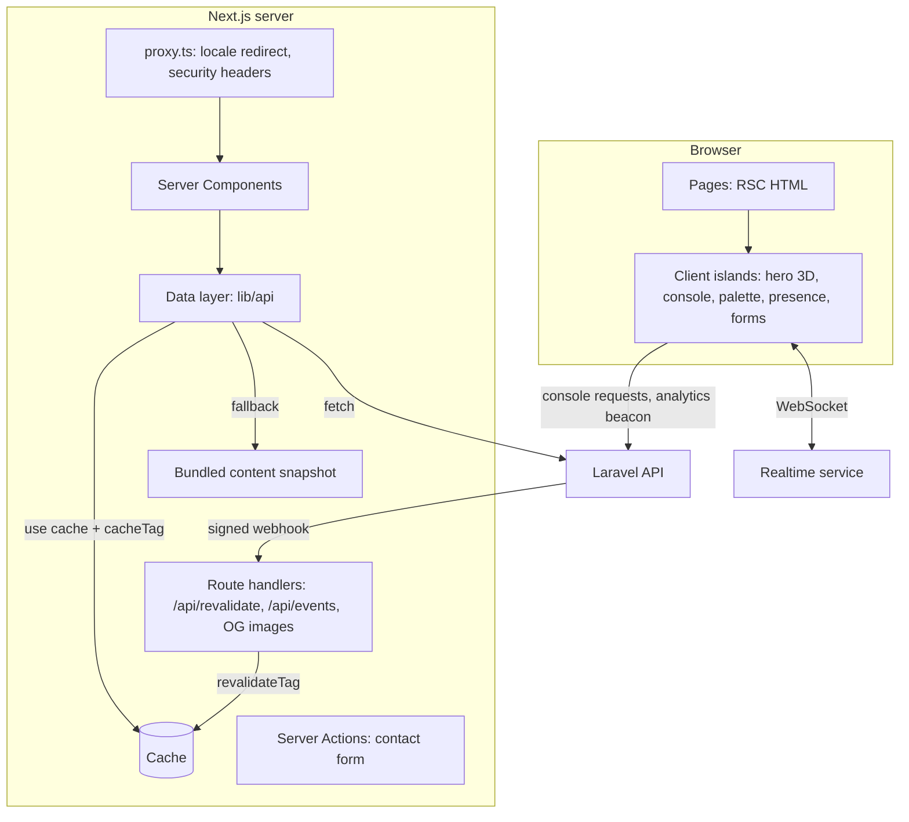

# Software Requirements Specification: Frontend

| | |
|---|---|
| **System** | Metrial Portfolio Web App (`my-app/`) |
| **Document** | SRS-FE v1.0 |
| **Date** | 2026-09-15 |
| **Owner** | Kareem Sabry Elsayed |
| **Traces to** | [BRS](BRS.md) · [PRD](PRD.md) |
| **Depends on** | [SRS Backend §5, API](SRS-backend.md#5-api-specification) |
| **Implemented by** | [Plan Frontend](plan-frontend.md) |

---

## 1. Introduction

### 1.1 Purpose

This document specifies the public web application: routing, rendering and caching, data access,
internationalization, design system, motion, the live backend showcase, SEO, accessibility, performance, and security.

### 1.2 Scope

The public site only. Content administration is handled by the backend admin (SRS-BE §3.3).

### 1.3 Important note on Next.js version

The app runs **Next.js 16.3** with **React 19.2**. Several APIs differ from older Next.js:
`middleware` is renamed **`proxy.ts`**; caching uses **Cache Components** (`cacheComponents: true`,
`'use cache'`, `cacheTag`, `cacheLife`); `revalidateTag(tag, profile)` takes a second argument;
`params` is a Promise. Before implementing any feature, read the matching guide in
`my-app/node_modules/next/dist/docs/` (see `my-app/AGENTS.md`).

## 2. Overall description

### 2.1 Technology stack

| Concern | Choice | Notes |
|---|---|---|
| Framework | Next.js 16.3 App Router, React 19.2, TypeScript (strict) | Existing app |
| Styling | Tailwind CSS v4 with CSS-variable design tokens (`@theme`) | Existing |
| Motion | **Motion** (`motion/react`) for UI, CSS scroll-driven animations where supported, React `<ViewTransition>` for route transitions | One animation library, no GSAP |
| 3D | **React Three Fiber** + **drei**, lazy-loaded client island | Hero mark only |
| Diagrams | **@xyflow/react** (React Flow) for interactive architecture diagrams | Loaded only on pages that use it |
| Command palette | **cmdk** | |
| Markdown | `react-markdown` + `rehype-sanitize` + `rehype-pretty-code` (Shiki) rendered on the server | |
| Validation | **Zod** for API response parsing and form schemas | |
| Realtime | `socket.io-client`, lazy-loaded | Presence and activity |
| Bot challenge | Privacy-friendly challenge widget (for example Cloudflare Turnstile) | Decision Q-6 |
| Unit and component tests | Vitest + Testing Library | |
| End-to-end and accessibility | Playwright + `@axe-core/playwright` | |
| Lint and format | ESLint (`eslint-config-next`), Prettier | |

> Pin **exact** versions at install time and record them in `package.json`. Do not assume APIs from
> memory; verify against each library's current docs.

### 2.2 Architecture



### 2.3 Directory structure (target)

```text
my-app/
├── proxy.ts                       # en-at-root rewrite, /en → / redirect, CSP nonce, security headers, noindex on non-production
├── app/
│   ├── favicon.ico  icon.svg  apple-icon.png          # done
│   ├── api/
│   │   ├── revalidate/route.ts    # signed webhook → revalidateTag
│   │   └── events/route.ts        # analytics beacon proxy (optional, first-party)
│   ├── cv/route.ts                # redirect to backend /cv (tracked)
│   └── [lang]/
│       ├── layout.tsx             # <html lang dir>, fonts, providers, header/footer
│       ├── page.tsx               # Home
│       ├── opengraph-image.tsx
│       ├── projects/page.tsx
│       ├── projects/[slug]/page.tsx  + opengraph-image.tsx
│       ├── experience/page.tsx
│       ├── about/page.tsx
│       ├── under-the-hood/page.tsx
│       ├── contact/page.tsx  + actions.ts
│       ├── insights/…            # v1.2
│       ├── not-found.tsx  error.tsx  loading.tsx
│   ├── sitemap.ts  robots.ts  llms.txt/route.ts  feed.xml/route.ts
├── components/
│   ├── ui/                        # Button, Badge, Card, Chip, Tabs, Dialog, Tooltip, Input…
│   ├── motion/                    # Reveal, Stagger, MagneticButton, CountUp, SlopeDivider
│   ├── sections/                  # Hero, LiveStrip, ProofStats, FeaturedProjects, Timeline, SkillsConstellation…
│   ├── showcase/                  # ApiConsole, StatusPanel, PresenceCounter, ActivityTicker, ArchitectureDiagram, GitHubHeatmap
│   ├── three/                     # HeroMark (R3F), lazy
│   └── layout/                    # Header, Footer, LanguageSwitch, CommandPalette, SkipLink
├── lib/
│   ├── api/                       # client.ts, schemas.ts (Zod), endpoints.ts, tags.ts
│   ├── i18n/                      # config.ts, dictionaries/{en,ar}.json, get-dictionary.ts
│   ├── analytics.ts  seo.ts  markdown.ts  env.ts
├── content/snapshot/{en,ar}.json  # build-time fallback snapshot
├── styles/tokens.css
└── tests/{unit,e2e}
```

## 3. Functional requirements

Format: **FR-FE-xx**, then the requirement, then *Traces* (PRD IDs).

### 3.1 Routing and internationalization

| ID | Requirement | Traces |
|---|---|---|
| FR-FE-01 | All pages shall live under `app/[lang]` with `lang ∈ {en, ar}`; any other value returns `notFound()`. Static params are generated for both locales. | PR-G1 |
| FR-FE-02 | **Public URLs:** English is served at the root without a prefix (`/`, `/projects/…`) and Arabic under `/ar/…`. `proxy.ts` shall (a) **rewrite** unprefixed paths internally to `/en/…`; (b) **308-redirect** any `/en/…` URL to its unprefixed form so English has one URL; (c) exclude `_next`, `api`, `cv`, and metadata files. There shall be **no automatic redirect based on `Accept-Language` or cookies** (it hides pages from crawlers, per [SEO.md §4](SEO.md#4-domain-and-url-decisions)); instead, visitors whose `Accept-Language` prefers Arabic see a dismissible "عرض الموقع بالعربية؟" banner linking to the `/ar` equivalent. | PR-G1, PR-J4 |
| FR-FE-03 | The root layout shall set `<html lang={lang} dir={lang === 'ar' ? 'rtl' : 'ltr'}>`. All layout spacing uses **logical CSS properties** (`ms-`/`me-`, `ps-`/`pe-`, `start`/`end`); directional icons and animations mirror in RTL. | PR-G1 |
| FR-FE-04 | UI strings come from server-only dictionaries (`lib/i18n/dictionaries/{en,ar}.json`) loaded in Server Components and passed to client islands as props. Content strings come from the API already localized. | PR-G1 |
| FR-FE-05 | The language switch shall keep the current path and query, set the `NEXT_LOCALE` cookie, and send `language_switch`. | PR-G1, PR-I1 |
| FR-FE-06 | Arabic numerals: Western Arabic digits (0–9) in both locales, for consistency with technical content; dates formatted with `Intl.DateTimeFormat(lang)`. | PR-G1 |

### 3.2 Data layer and caching

| ID | Requirement | Traces |
|---|---|---|
| FR-FE-10 | `next.config.ts` shall enable `cacheComponents: true`. | PR-G5 |
| FR-FE-11 | `lib/api/client.ts` shall expose typed functions (`getSite`, `getProfile`, `getExperiences`, `getSkills`, `getCredentials`, `getProjects`, `getProject`, `getStats`, `getSitemap`, `getGithub`) that call the backend server-side with `?lang=` and a 5 s timeout, and parse the envelope with **Zod** schemas mirroring SRS-BE §5. | PR-A1–C4 |
| FR-FE-12 | Each data function shall use `'use cache'` with `cacheTag()` values from the shared tag contract (SRS-BE FR-BE-51), for example tags `projects` and `project:{slug}`, plus a `cacheLife` profile of hours (safety net; webhooks drive freshness). | PR-H5 |
| FR-FE-13 | If a backend call fails (network error, timeout, 5xx, or schema mismatch), the data layer shall return data from `content/snapshot/{lang}.json`, log a structured warning, and **never** render an error page for public content. | PR-G5, BR-15 |
| FR-FE-14 | A build script (`npm run snapshot`) shall fetch all public endpoints for both locales and write the snapshot files; CI runs it before `next build`, and the build fails if the snapshot does not validate. | PR-G5 |
| FR-FE-15 | Until the backend exists, `API_MODE=fixtures` shall serve typed fixtures (same Zod schemas) so frontend work is not blocked. | Plan |

### 3.3 Revalidation

| ID | Requirement | Traces |
|---|---|---|
| FR-FE-20 | `POST /api/revalidate` shall verify `X-Webhook-Signature` (`t=<ts>,v1=<hmac>`, HMAC-SHA256 of `"{t}.{raw_body}"` with `REVALIDATE_SECRET`), using a constant-time compare, rejecting timestamps older than 5 minutes, and de-duplicating event `id`s (in-memory LRU). | PR-H5 |
| FR-FE-21 | On a valid event it shall call `revalidateTag(tag, 'max')` for every tag in `data.tags` and respond `200 { revalidated: [...] }`; otherwise `401` (bad signature) or `400` (bad payload). | PR-H5, BR-08 |

### 3.4 Pages

| ID | Page | Requirement | Traces |
|---|---|---|---|
| FR-FE-30 | Home | Sections in order: Hero, Live strip, Proof stats, Featured projects, Experience snapshot, Skills (constellation from v1.1, grouped list in v1.0), Closing CTA. Content from `getSite`, `getProfile`, `getStats`, `getProjects({featured})`, `getExperiences`, `getSkills`. | PR-A1–A8 |
| FR-FE-31 | Hero | Name as the H1; rotating specialties (text swap, not a typewriter, and static with reduced motion); availability badge driven by `site.availability`; CTAs *View work* (→ `/projects`), *Download CV* (→ `/cv`), *Contact*. Above-the-fold content is server-rendered with no layout shift. | PR-A1 |
| FR-FE-32 | Live strip | Client island calls `GET {API}/health` from the browser after idle; shows `● operational · 42 ms · req 7f3a…` using the response time and `X-Request-Id`; degrades to "status unavailable" without error styling. Clicking opens the Under the Hood page. | PR-A3 |
| FR-FE-33 | Projects index | Grid of cards with domain, tagline, stack chips, and cover image; filters (domain, skill) are URL search params and rendered on the server; the empty state offers to clear filters. | PR-B1 |
| FR-FE-34 | Case study | Renders the sections from Markdown on the server (sanitized), a media gallery (`next/image`, lightbox), store links with official badges, a technology list, a prev/next project, and a confidentiality note for `summary_only` projects (summary layout only). `generateStaticParams` covers all public slugs. | PR-B2, PR-B5, PR-B7 |
| FR-FE-35 | Experience | Vertical timeline (horizontal on desktop ≥ 1280 px optional), "Present" badge, highlights, linked project chips; skills matrix; education and certificates. | PR-C1–C3 |
| FR-FE-36 | About | Story, working principles, relocation statement, photo (optional, owner-supplied). | PR-C4 |
| FR-FE-37 | Contact | Form (FR-FE-50), direct channels from `site.contact_channels` (phone only if returned), response-time expectation text. | PR-E1–E5 |
| FR-FE-38 | Under the Hood | API console, status panel, presence and activity, this site's architecture diagram, engineering facts, GitHub activity; each block hidden when its feature flag is off (`site.flags`). | PR-F1–F6 |
| FR-FE-39 | CV | `/cv` route handler redirects (`307`) to `{API}/cv?lang=` with a `source` param; every "Download CV" control links there. | PR-D1, PR-D3 |
| FR-FE-40 | Errors | Localized `not-found` with links to Home and Projects; `error.tsx` with a retry for client-island failures only. | – |

### 3.5 Contact form

| ID | Requirement | Traces |
|---|---|---|
| FR-FE-50 | Fields: name, email, inquiry type (segmented control), message (with character counter), hidden honeypot `website`, bot-challenge widget; client and server validation with the same Zod schema and localized messages. | PR-E1, PR-E2 |
| FR-FE-51 | Submission uses a **Server Action** with `useActionState`: measures `elapsed_ms` from first interaction, calls `POST {API}/contact` server-side, and maps `422` field errors to inputs and `429` to a friendly retry message. Works without JavaScript (progressive enhancement), apart from the challenge widget fallback. | PR-E1 |
| FR-FE-52 | On success, replace the form with a confirmation panel (focus moved to its heading), send `contact_submit`, and prevent double submits while pending. | PR-E4 |

### 3.6 Live backend showcase

| ID | Requirement | Traces |
|---|---|---|
| FR-FE-60 | **API console:** loads the allowlist from `/showcase/endpoints`; endpoint picker, param inputs, `lang` toggle, *Send* button; shows method, URL, status pill, total time (client-measured) and `Server-Timing` breakdown, selected response headers (`X-Request-Id`, `X-RateLimit-*`, `Cache-Control`, `ETag`), and highlighted, collapsible JSON; copy as `curl`; history of the last 5 requests in session memory. Calls go **directly from the browser to the API** (real CORS, real latency). | PR-F1 |
| FR-FE-61 | The console shall handle `429` by showing the rate-limit reset countdown, which demonstrates the throttling feature. | PR-F1 |
| FR-FE-62 | **Status panel:** polls `/showcase/status` every 30 s while visible (`IntersectionObserver` + `document.visibilityState`) and shows health dots, heartbeat age, last sync times, and version. | PR-F2 |
| FR-FE-63 | **Presence:** lazy-connects `socket.io-client` to the public namespace only when the counter scrolls into view or on the Under the Hood page; shows the online count with an animated number and an activity ticker (max 5 items, country flag + project title); disconnects when hidden for 60 s; hidden entirely if the connection fails. | PR-F3 |
| FR-FE-64 | **Architecture diagrams:** React Flow canvas from `project.architecture` JSON (and a static JSON for "this site"); nodes styled as METRIAL cards, animated dashed edges showing data direction, hover to highlight a path, keyboard focusable nodes with text descriptions, and a static SVG/list fallback with reduced motion or on small screens. | PR-B3, PR-F4 |
| FR-FE-65 | **Flow / state machine:** renders `project.flow` as steps that animate on scroll (the current state is highlighted in gold) and shows an accessible ordered list with reduced motion. | PR-B4 |
| FR-FE-66 | **GitHub heatmap:** renders the contribution calendar as an SVG grid in METRIAL gold intensity steps with a "last synced" label; shows a stale badge when `meta.stale`. | PR-F6 |

### 3.7 Global UX

| ID | Requirement | Traces |
|---|---|---|
| FR-FE-70 | **Header:** M mark + wordmark, nav (Projects, Experience, Under the Hood, About, Contact), language switch, ⌘K hint, sticky *Download CV*; condenses on scroll; mobile menu is a full-screen sheet with focus trap. | PR-D1, PR-G4 |
| FR-FE-71 | **Command palette** (⌘K / Ctrl+K / `/`): pages, projects (fuzzy search), actions (copy email, download CV, switch language, open GitHub/LinkedIn, toggle reduced effects); fully keyboard operable; RTL aware. | PR-G4 |
| FR-FE-72 | **Hero 3D mark:** extrude the five polygons of `images/metrial-mark.svg` into a metallic gold mesh with soft studio lighting; rotate gently toward the pointer (max 12°) and on scroll. It loads **after** first paint as a client-only dynamic import only when `(prefers-reduced-motion: no-preference)`, the device reports `hardwareConcurrency ≥ 4`, and WebGL2 is available; otherwise the static SVG mark with a CSS sheen is shown. It pauses rendering when off-screen. | PR-A2 |
| FR-FE-73 | **Motion primitives:** `Reveal` (fade/translate on enter, once), `Stagger`, `CountUp` (for stats, runs once), `MagneticButton` (pointer devices only), `SlopeDivider` (0.625 diagonal motif). All respect `useReducedMotion()`. | PR-G3 |
| FR-FE-74 | **Route transitions:** React `<ViewTransition>` crossfade between pages; shared-element morph from a project card cover to the case-study hero (v1.1). Disabled with reduced motion. | PR-B6, PR-G3 |
| FR-FE-75 | **Terminal mode** (v1.2): typing `/` then `terminal` in the palette opens an overlay shell with the commands `help`, `whoami`, `projects`, `open <slug>`, `cv`, `contact`, `lang ar/en`, `exit`. | PR-G6 |

### 3.8 Analytics

| ID | Requirement | Traces |
|---|---|---|
| FR-FE-80 | `lib/analytics.ts` shall queue events (PRD §10) and flush with `navigator.sendBeacon` to `POST {API}/analytics/events` (or first-party `/api/events`) on page hide or when 10 events are queued. No cookies, localStorage identifiers, or third-party scripts. | PR-I1 |
| FR-FE-81 | When `navigator.doNotTrack === '1'` or `navigator.globalPrivacyControl === true`, only `page_view` is sent and it is flagged anonymous. | PR-I3 |
| FR-FE-82 | `project_view` fires after the case study has been visible for 5 s; `page_view` fires on every client navigation. | PR-I1 |

### 3.9 SEO and sharing

Goal: first Google result for the owner's name, brand, and role queries (BR-18). Strategy: [SEO.md](SEO.md).
Before implementing, read `03-api-reference/03-file-conventions/01-metadata/*` and `03-api-reference/04-functions/generate-metadata.md`.

| ID | Requirement | Traces |
|---|---|---|
| FR-FE-90 | Every page exports `generateMetadata` using the owner-edited SEO fields from the API (falling back to the [SEO.md §6](SEO.md#6-on-page-templates) templates): title ≤ 60 chars containing the name, description 140–160 chars, **absolute self-referencing canonical**, and `alternates.languages` for `en` (unprefixed URL), `ar` (`/ar` URL), and `x-default` (English). Filtered list URLs (`?filter[...]`) canonicalize to the unfiltered page. | PR-J1, PR-J5 |
| FR-FE-91 | `opengraph-image.tsx` (ImageResponse) for Home and each project and article: charcoal background, gold M mark, title, tagline, and domain chip; 1200×630; both locales (Arabic with an embedded Arabic font). An admin OG override image wins when set. | PR-J2 |
| FR-FE-92 | `sitemap.ts` from `getSitemap()`: every public URL in both locales with accurate `lastmod`, `alternates` (hreflang) entries, and image entries for project covers. `robots.ts` allows all in production and references the sitemap. | PR-J1, PR-J7 |
| FR-FE-93 | JSON-LD on every page, built by `lib/seo.ts`: a `Person` node with a stable `@id` (`{site}/#person`), `name`, `alternateName` (`Karem Metrial`, `Kareem Sabry Elsayed`, `كريم صبري`), `jobTitle`, `worksFor`, `alumniOf`, `address` (Mansoura, EG), `knowsAbout` (skills from the API), `image`, and `sameAs` (LinkedIn, GitHub, Packagist, plus owner-configured profiles); a `WebSite` node (`alternateName: Metrial`); `ProfilePage` (About, `mainEntity` → person `@id`); `CreativeWork` per case study (`author` → person `@id`); `BlogPosting` per article; `BreadcrumbList` on nested pages. The JSON is serialized with `<` escaped to prevent script injection, and a unit test validates every page's graph against schema.org types. | PR-J3 |
| FR-FE-94 | **Crawlable HTML:** all indexable text (hero, summaries, case-study sections, experience, skills, articles) is present in the server-rendered HTML response. Client islands may add interactivity but never hold unique indexable content. An e2e test fetches each route with JavaScript disabled and asserts key text and the H1 exist. | PR-J4 |
| FR-FE-95 | **Status codes and redirects:** unknown slugs return a real `404` via `notFound()`; the proxy or page applies owner-managed **301 redirects** from the API `/redirects` list (old slug → new slug) before rendering; no redirect chains. | PR-J6 |
| FR-FE-96 | **Indexing safety:** when `NEXT_PUBLIC_SITE_URL` is not the production origin, `proxy.ts` adds `X-Robots-Tag: noindex, nofollow` to every response and `robots.ts` disallows all; `/dev/*` routes are always `noindex`. | PR-J9 |
| FR-FE-97 | **Internal linking:** case studies show related projects (shared domain or skills) and related articles; articles link to their case study; every nested page renders visible breadcrumbs matching the `BreadcrumbList`. | PR-J8 |
| FR-FE-98 | **`/llms.txt`** route: a plain-text summary of who Kareem is, his role, stack, location, and links to key pages, generated from the API. | PR-J10 |
| FR-FE-99 | **`/feed.xml`** RSS for articles in each locale (v1.1). | PR-K2 |

## 4. Design system

### 4.1 Tokens (from the brand sheet)

```css
@theme {
  --color-gold: #C6A86A;       /* Premium Gold: accents, focus ring, key data */
  --color-gold-light: #E2C88F; /* gradient highlight */
  --color-gold-dark: #9E8150;  /* gradient shadow, pressed */
  --color-charcoal: #111318;   /* canvas */
  --color-surface: #181B22;    /* cards (derived) */
  --color-line: #2A2E37;       /* borders (derived) */
  --color-silver: #8B919B;     /* secondary text */
  --color-offwhite: #F4F5F7;   /* primary text on dark */
  --radius-card: 1rem;
  --slope: 0.625;              /* M-mark diagonal */
}
```

- **Contrast:** body text `offwhite` on `charcoal` is about 17:1; `silver` on `charcoal` must be verified at ≥ 4.5:1 before using it for body-size text; gold is used for text only at ≥ 18 px or bold ≥ 14 px, after verifying contrast.
- **Typography (via `next/font`, self-hosted):** Display **Montserrat** (600–700, uppercase labels with wide tracking); Body **Inter**; Mono **JetBrains Mono**; Arabic **IBM Plex Sans Arabic**. Final pick confirmed in the design phase, with `font-display: swap` and subsetting.
- **Spacing:** 4 px base scale; section vertical rhythm 96 px desktop / 64 px mobile.
- **Icons:** a single consistent icon set (for example Lucide), with directional icons mirrored in RTL.

### 4.2 Core components

Button (primary gold / ghost / link; magnetic variant), Badge (availability pulse), Chip (technology),
Card (project, with gold border sheen on hover), Section header (eyebrow label + title + slope divider),
Timeline item, Stat, Tabs, Dialog / Sheet, Tooltip, Input / Textarea / Segmented control, Toast,
Code block (Shiki), JSON viewer, Skeleton.

Every component: keyboard accessible, visible focus ring (2 px gold, 2 px offset), RTL-safe, reduced-motion-safe, and documented by a demo route `/[lang]/dev/ui` that is excluded in production.

## 5. Non-functional requirements

### 5.1 Performance budgets

| ID | Metric (mobile, p75 real users; lab Moto G Power / Slow 4G for Lighthouse) | Target |
|---|---|---|
| NFR-FE-P1 | LCP | ≤ 2.0 s (lab), ≤ 2.5 s (field) |
| NFR-FE-P2 | INP | ≤ 200 ms |
| NFR-FE-P3 | CLS | ≤ 0.05 |
| NFR-FE-P4 | Lighthouse Performance, Accessibility, Best Practices ≥ 95; **SEO = 100** | Home, Projects, a case study, an article |
| NFR-FE-P5 | Initial JS (gzip) on Home, excluding lazy islands | ≤ 170 KB |
| NFR-FE-P6 | 3D island (gzip), loaded after LCP | ≤ 250 KB, and never on reduced-motion or low-power devices |
| NFR-FE-P7 | Images | `next/image`, AVIF/WebP, explicit dimensions, `priority` only for the LCP image |
| NFR-FE-P8 | Fonts | ≤ 4 font files on first load, preloaded, subset |

A CI performance check (Lighthouse CI) fails the build when budgets are exceeded.

### 5.2 Accessibility

| ID | Requirement |
|---|---|
| NFR-FE-A1 | WCAG 2.2 AA across all pages in both locales. |
| NFR-FE-A2 | Skip link, landmark regions, one H1 per page, logical heading order. |
| NFR-FE-A3 | All interactive elements are reachable and operable by keyboard; the command palette, dialogs, and mobile menu trap and restore focus. |
| NFR-FE-A4 | `prefers-reduced-motion: reduce` disables 3D, parallax, magnetic effects, count-ups, view transitions, and auto-rotating text. |
| NFR-FE-A5 | Diagrams, heatmaps, and flows have text alternatives (lists or tables). |
| NFR-FE-A6 | Automated axe checks show zero serious or critical violations in Playwright for every route in en and ar. |

### 5.3 Security

| ID | Requirement |
|---|---|
| NFR-FE-S1 | Content Security Policy with nonce generated in `proxy.ts` (per the Next.js CSP guide): `default-src 'self'`; `connect-src` limited to the API origin, the realtime origin, and the challenge provider; `img-src` self + API media origin + `data:`; `frame-src` only the challenge provider; `frame-ancestors 'none'`. |
| NFR-FE-S2 | Headers: `Strict-Transport-Security`, `X-Content-Type-Options: nosniff`, `Referrer-Policy: strict-origin-when-cross-origin`, `Permissions-Policy` (camera, microphone, geolocation disabled). |
| NFR-FE-S3 | Server-only secrets (`REVALIDATE_SECRET`, `API_INTERNAL_URL`, `BOT_CHALLENGE_SECRET` if used server-side) are never imported into client components; enforced with the `server-only` package. |
| NFR-FE-S4 | All Markdown from the API is rendered through a sanitizing pipeline (`rehype-sanitize`). Raw HTML injection into the DOM is forbidden, with the single exception of the JSON-LD script from FR-FE-93. |

### 5.4 Reliability

| ID | Requirement |
|---|---|
| NFR-FE-R1 | With the backend fully down, every public page still renders from cache or the snapshot (verified by an e2e test with the API mocked to fail). |
| NFR-FE-R2 | Client islands fail closed: a failing console, presence, or 3D island hides itself and never breaks the page. |

### 5.5 Browser support

Latest two versions of Chrome, Edge, Firefox, and Safari (macOS and iOS), plus Samsung Internet.
Where the View Transitions API or CSS scroll-driven animations are unsupported, the site degrades to no animation.

### 5.6 Quality gates

`npm run lint`, `tsc --noEmit`, Vitest (≥ 80% coverage of `lib/`), Playwright e2e (en + ar, desktop +
mobile viewports), axe, Lighthouse CI, and the snapshot schema validation must all pass in CI.

## 6. Configuration

| Variable | Scope | Purpose |
|---|---|---|
| `NEXT_PUBLIC_SITE_URL` | public | Canonical base URL |
| `NEXT_PUBLIC_API_URL` | public | Browser calls (console, analytics, health) |
| `API_INTERNAL_URL` | server | Server-side fetches (can be a private network URL) |
| `NEXT_PUBLIC_REALTIME_URL` | public | Socket.IO endpoint |
| `REVALIDATE_SECRET` | server | Webhook HMAC secret (same value as backend `FRONTEND_REVALIDATE_SECRET`) |
| `NEXT_PUBLIC_BOT_CHALLENGE_SITE_KEY` | public | Challenge widget |
| `API_MODE` | server | `live` or `fixtures` |

## 7. Deployment

Default: **Vercel** (native Next.js features, edge CDN, free tier) with the API on the VPS.
Alternative: self-hosted `next start` in Docker behind the same reverse proxy as the API (see the Next.js
self-hosting guide; a shared cache handler is needed only for multiple instances). Decision Q-4.

## 8. Traceability (BRS → frontend requirements)

| BRS | Frontend requirements |
|---|---|
| BR-01 | FR-FE-30, 31 |
| BR-02 / BR-03 | FR-FE-33, 34, 64, 65 |
| BR-04 | FR-FE-35 |
| BR-05 | FR-FE-39, 70 |
| BR-06 | FR-FE-37, 50–52 |
| BR-07 | FR-FE-32, 60–66 |
| BR-08 | FR-FE-12, 20, 21 |
| BR-09 | FR-FE-01–06, 91 |
| BR-10 | FR-FE-90–99 |
| BR-18 | FR-FE-02, 90–98, §5.1 (Core Web Vitals) |
| BR-11 | FR-FE-80–82 |
| BR-12 | §4, FR-FE-72–74 |
| BR-13 | §5.1, §5.2 |
| BR-14 | FR-FE-50, 51, NFR-FE-S1 |
| BR-15 | FR-FE-13, 14, NFR-FE-R1 |
